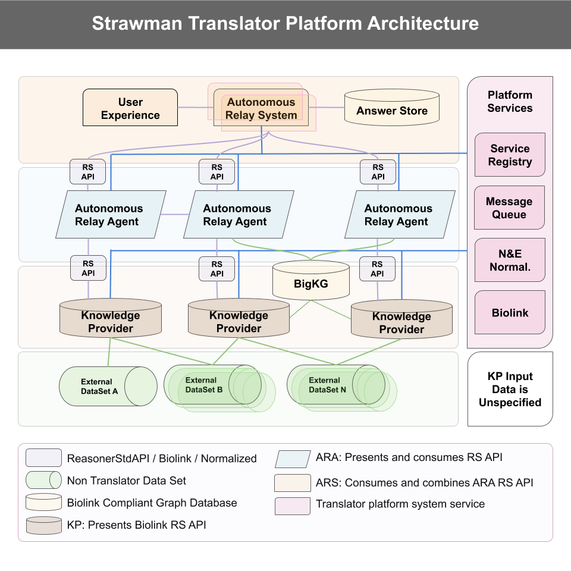

# TranslatorArchitecture

## Process

This repository tracks the decision making for the Translator architecture.

This README documents the current strawman architecture.  Changes must be made via pull requests.   Questions or discussion around a topic that is not easily related to a specific pull request occurs in github issues.

## Definitions

  * Message: A Message object as defined in the Translator Reasoner API [here](https://github.com/NCATSTranslator/ReasonerAPI/blob/master/TranslatorReasonerAPI.yaml#L161)
  * KP (Knowledge Provider): a Translator software component, not a project team
  * ARA (Automated Relay Agent): a Translator software component, not a project team
  * KS (Knowledge Source): a non-Translator source of information that can be ingested to produce a KP.

## Architecture Principles

1. The goal is to create a single integrated product from federated services and data
1. Which components communicate with one another?
    1. ARS broadcasts query (Message) to one or more ARAs
    1. ARAs respond to ARS with Message
    1. ARA sends query messages to KPs
    1. KPs respond to ARAs with Message
1. Interfaces:
   1. All communication between the ARS and ARAs conforms to the ReasonerAPI Message spec
   1. KP can expose their information using these methods:
      1. ReasonerAPI Message
      1. Any SmartAPI-annotated interface
      1. A file dump conforming to KGX standards
   1. The Translator consortium will develop tools to automatically 
      1. proxy ReasonerAPI calls to smartAPI calls and 
      1. deploy ReasonerAPIs of KGX file dumps 
   1. Subsequent requirements on KPs in this document will specify their application to ReasonerAPI, SmartAPI, and/or KGX interfaces.
1. Entities in any ReasonerAPI message (ARS/ARA or ARA/KP) or KGX file-based communication are represented using compact URIs (CURIES), which must be expandable to full IRIs using a biolink-model provided json-ld context file.  Entities returned from a non-ReasonerAPI smartAPI-registered KP must provide sufficient information in the registry to allow an automated conversion of the entity identifier to a biolink-model CURIE.
1. Node Identifiers
   1. KPs must expose machine readable information about the types of node identifiers that they consume and produce.
   1. ARAs or other integration tools such as KGX will perform node identifier equivalence translations.
   1. The consortium will produce or adopt equivalent id sets, which will be shared across Translator tools.  Multiple Translator teams will contribute expertise to these sets, but that expertise will produce centralized results.
   1. SRI will provide tools for disseminating these equivalent identifiers, drawing on the prior work of multiple Translator teams.
1. ARAs and KPs may both score answers (provide scores in the message); ARAs are required to score answers.
1. KPs should not call other KPs.
1. ARAs obtain biomedical data only via KPs (or other ARAs), not from locally-cached aggregated graphs or non-Translator data sources.
1. Aggregated graphs must be created at the consortium level and exposed as a KP.
1. Components that do not fulfill the responsibilities of KPs and ARAs can still be stand-alone elements of the architecture to provide particular functionality; such tools will use the Translator ReasonerAPI whenever possible.
1. Answer persistence will be the responsibility of the ARS.
1. A system-wide UI will (eventually) exist, and will allow users to interpret answers, and reformulate questions.
1. The SmartAPI registry will serve as a Translator Registry, and will expose programmatically accessible metadata about KPs and ARAs.
    1. All REST-Style SmartAPI KPs must be registered in the Translator Registry.
    1. All Translator Reasoner API KPs must be registered in the Translator Registry. All metadata for Translator Reasoner APIs must be available via endpoints at the service, from which it will be extracted by the SmartAPI Registry.
    1. All KGX files intended for graph transfer must be registered in the Translator Registry. All metadata for KGX files must be contained in associated metadata files and exposed via an API, which will be consumed by the SmartAPI Registry.
    1. All ARA must be registered in the Translator Registry.  The ARS will not require a separate registration.
    1. Each type of component must provide the metadata described [here](RegistryMetadata.md)
    1. Non-KP, Non-ARA components, such as normalizers, must also be registered and provide metadata appropriate to their API type.
    1. The SmartAPI Registry will provide a unified query system, returning information about all three API methods.  This query system will allow ARAs to locate the appropriate KPs.
    1. SRI will guarantee that metadata standards across the components allow such a unified query system.
1. A continuous integration framework will consume metadata from the registry, and provide automated testing and reports.
1. Both KPs and ARAs should acquire and transmit provenance information to the fullest possible extent.

## Diagram

